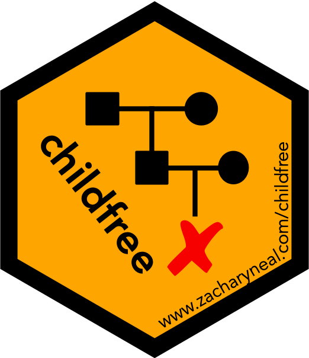

```{r, include = FALSE}
knitr::opts_chunk$set(collapse = TRUE, comment = "#>")
knitr::opts_knit$set(global.par = TRUE)
```

# Table of Contents {#toc}

[](https://www.zacharyneal.com/childfree)

1. [Introduction](#introduction)
2. [Codebooks](#data)
    a. [Demographic and Health Surveys (DHS)](#dhs)
    b. [National Survey of Family Growth](#nsfg)
    c. [State of the State Survey](#soss)

# Introduction {#introduction}

## Welcome {#welcome}
Thank you for your interest in the childfree package! This vignette contains codebooks for dataframes created by the package's functions from publicly-accessible data. The [Introduction to Childfree](childfree.html) vignette provides a more general introduction.

The `childfree` package can be cited as:

**Neal, Z. P. and Neal, J. W. (2024). childfree: An R package to access and harmonize childfree demographic data. *Comprehensive R Archive Network*. [https://cran.r-project.org/package=childfree](https://cran.r-project.org/package=childfree)**

For additional resources on the childfree package, please see [https://www.zacharyneal.com/childfree](https://www.zacharyneal.com/childfree).

If you have questions about the childfree package or would like a childfree package hex sticker, please contact the maintainer Zachary Neal by email ([zpneal\@msu.edu](mailto:zpneal@msu.edu)). Please report bugs in the backbone package at [https://github.com/zpneal/childfree/issues](https://github.com/zpneal/childfree/issues).

## Demographic and Health Surveys (DHS) {#dhs}
This table summarizes the variables that are contained in dataframes generated from [**Demographic and Health Surveys**](https://dhsprogram.com/) data using `dhs()`.

| Variable | Source | Format | Coding ______________________________ |
| :--- | :--- | :--- | --- |
| `cf_want` | `v201` <br> `v602` | Binary | 0 = Not childfree <br> 1 = Childfree |
| `cf_ideal` | `v201` <br> `v613` | Binary | 0 = Not childfree <br> 1 = Childfree |
| `famstat` | `v201` <br> `v602` <br> `v613` | Categorical | 1 = Parent-Unclassified <br> 2 = Parent-Fulfilled <br> 3 = Parent-Unfulfilled <br> 4 = Parent-Relunctant <br> 5 = Parent-Ambivalent <br> 6 = Not yet parent <br> 9 = Childless-Biological <br> 10 = Ambivalent non-parent <br> 11 = Undecided <br> 12 = Childfree |
| `sex` | --- | Categorical | 1 = Female |
| `age` | `v012` | Numeric | In years |
| `education` | `v133` | Numeric | In years |
| `partnered` | `v502` | Categorical | 1 = Single, never partnered <br> 2 = Currently partnered <br> 3 = Formerly partnered |
| `residence` | `v102` | Ordinal | 1 = Rural <br> 4 = Urban |
| `employed` | `v714` | Binary | 0 = Not employed <br> 1 = Employed |
| `religion` | `v130` | Categorical | 1 = None, <br> 2 = Catholic / Orthodox <br> 3 = Muslim <br> 4 = Jewish <br> 5 = Protestant / Christian <br> 6 = Other <br> 7 = Buddhist <br> 8 = Hindu |
| `id` | `caseid` | string |
| `country` | `v000` | string |
| `weight` | `v005` | string |
| `file` | user | string |
| `survey` | "DHS" | string |
| `wave` | `v000` | numeric |
| `year` | `v007` | numeric |
| `month` | `v006` | ordinal |

[back to Table of Contents](#toc)

## National Survey of Family Growth (NSFG) {#nsfg}
This table summarizes the variables that are contained in dataframes generated from [**National Survey of Family Growth**](https://www.cdc.gov/nchs/nsfg/index.htm) data using `nsfg()`.

| Variable | Source | Format | Coding ______________________________ |
| :--- | :--- | :--- | --- |
| `cf_want` | `hasbabes` <br> `everadpt` <br> `seekadpt` <br> `rwant` | Binary | 0 = Not childfree <br> 1 = Childfree |
| `famstat` | `hasbabes` <br> `everadpt` <br> `seekadpt` <br> `rwant` <br> `rstrstat` <br> `pstrstat` <br> `intend` <br> `jintend` | Categorical | 1 = Parent-Unclassified <br> 3 = Parent-Unfulfilled <br> 5 = Parent-Ambivalent <br> 6 = Not yet parent <br> 8 = Childless - Social <br> 9 = Childless - Biological <br> 10 = Ambivalent non-parent <br> 11 = Undecided <br> 12 = Childfree |
| `sex` | --- | Categorical | 1 = Female |
| `hispanic` | `rscrhisp` | Binary | 0 = Not hispanic <br> 1 = Hispanic |
| `race` | `rscrrace` | Categorical | 1 = White <br> 2 = Black <br> 3 = Hawaiian <br> 4 = Asian <br> 5 = American Indian <br> 6 = Other |
| `age` | `age_r` | Numeric | In years |
| `education` | `higrade` <br> `dipged` <br> `degrees` | Ordinal | 2 = Did not graduate high school <br> 3 = High School graduate <br> 4 = Some college <br> 5 = College graduate <br> 7 = Graduate degree |
| `partnered` | `marstat` | Categorical | 1 = Single, never partnered <br> 2 = Currently partnered <br> 3 = Formerly partnered |
| `residence` | `metro` | Ordinal | 1 = Rural <br> 3 = Suburb <br> 4 = Urban |
| `employed` | `rwrkst` | Binary | 0 = Not employed <br> 1 = Employed |
| `inschool` | `goschol` | Binary | 0 = Not in school <br> 1 = In school |
| `religion` | `relcurr` | Categorical | 1 = None <br> 2 = Catholic / Orthodox <br> 5 = Protestant / Christian <br> 6 = Other |
| `id` | `caseid` | string |
| `country` | "United States" | string |
| `weight` | `wgt2017_2019` <br> `wgt2015_2019` <br> `wtg2013_2015` <br> `wtg2011_2013` <br> `WGTQ1Q16` <br> `finalwgt` | string |
| `file` | user | string |
| `survey` | "NSFG" | string |
| `wave` | user | string |
| `year` | `cmintvw` | numeric |
| `month` | `cmintvw` | ordinal |

[back to Table of Contents](#toc)

## State of the State Survey (SOSS) {#soss}
This table summarizes the variables that are contained in dataframes generated from [**State of the State Survey**](http://ippsr.msu.edu/survey-research/state-state-survey-soss) data using `soss()`.

| Variable | Source | Format | Coding ______________________________ |
| :--- | :--- | :--- | --- |
| `cf_want` | `neal1` <br> `neal2` <br> `neal3` | Binary | 0 = Not childfree <br> 1 = Childfree |
| `famstat` | `neal1` <br> `neal2` <br> `neal3` | Categorical | 1 = Parent-Unclassified <br> 6 = Not yet parent <br> 7 = Childless - Unclassified <br> 10 = Ambivalent non-parent <br> 11 = Undecided <br> 12 = Childfree |
| `sex` | `cd1` | Categorical | 1 = Female <br> 2 = Male <br> 3 = Other |
| `hispanic` | `cd5a` | Binary | 0 = Not hispanic <br> 1 = Hispanic |
| `race` | `cd4_1` <br> `cd4_2` <br> `cd4_3` <br> `cd4_4` <br> `cd4_5` <br> `cd4_6` | Categorical | 1 = White <br> 2 = Black <br> 3 = Hawaiian <br> 4 = Asian <br> 5 = American Indian <br> 6 = Other <br> 7 = Multiracial |
| `age` | `cd2` | Numeric | In years |
| `education` | `cd3` | Ordinal | 1 = No education <br> 2 = Did not graduate high school <br> 3 = High School graduate <br> 4 = Some college <br> 5 = College graduate <br> 6 = Some post-graduate <br> 7 = Graduate degree |
| `partnered` | `cd8` | Categorical | 1 = Single, never partnered <br> 2 = Currently partnered <br> 3 = Formerly partnered |
| `residence` | `x1` | Ordinal | 1 = Rural <br> 2 = Town <br> 3 = Suburb <br> 4 = Urban |
| `employed` | `cd15` | Binary | 0 = Not employed <br> 1 = Employed |
| `inschool` | `cd15` | Binary | 0 = Not in school <br> 1 = In school |
| `ideology` | `ideology` | Ordinal | 1 = Very conservative <br> 2 = Somewhat conservative <br> 3 = Closer to the conservative side <br> 4 = In the middle <br> 5 = Closer to the liberal side <br> 6 = Somewhat liberal <br> 7 = Very liberal |
| `religion` | `cd6` | Categorical | 1 = None <br> 2 = Catholic / Orthodox <br> 3 = Muslim <br> 4 = Jewish <br> 5 = Protestant / Christian <br> 6 = Other |
| `id` | `caseid` | string |
| `country` | "United States" | string |
| `weight` | `weight` | string |
| `file` | user | string |
| `survey` | "SOSS" | string |
| `wave` | user | string |
| `year` | documentation | numeric |
| `month` | documentation | ordinal |

[back to Table of Contents](#toc)
